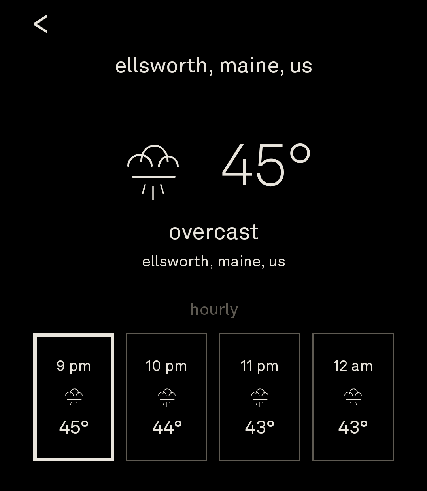

# simplecast

simplecast is a minimal Android weather app designed for the Light Phone III Android layer.

It uses Open-Meteo for weather and geocoding, keeps the interface black-and-white, and avoids ads, accounts, analytics, and unnecessary UI.



## Features

- Current conditions with animated monochrome glyphs
- 12-hour forecast in three instant-swipe pages of four hours
- 10-day forecast in two instant-swipe pages of five days
- Place search using Open-Meteo geocoding
- Configurable home location
- Optional 10-minute background weather checks
- True AMOLED black background
- Native Android app built with Jetpack Compose

## Gestures

- Pull down on home: refresh
- Swipe up from home: 10-day forecast
- Swipe down from first 10-day page: home
- Swipe left/right on hourly forecast: next/previous 4-hour pane
- Swipe right from home: search
- Swipe left from home: settings

## Build

Requires JDK 17 or newer and the Android SDK.

```powershell
.\gradlew.bat assembleRelease
```

The release APK is generated at:

```text
app/build/outputs/apk/release/app-release.apk
```
